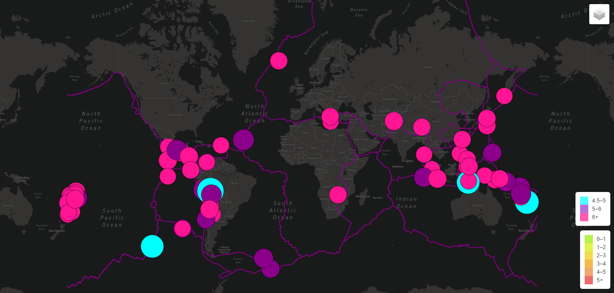
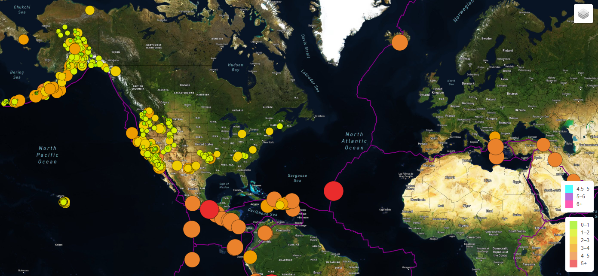
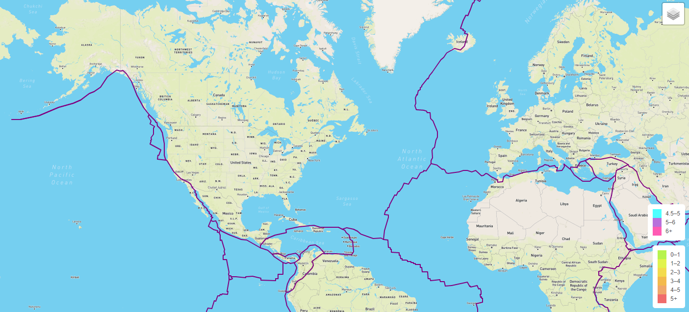

# Mapping_Earthquakes

### Resources:
- Leaflet | JavaScript | HTML | Mapbox API

### Project Overview:
The project guidelines required a 3 layer interactive map using Leaflet to display the last 7 days of earthquake activity
on a global scale. The data is displayed as 3 optional layer views: Street, Sattelite and Dark mapping, with the selection of
3 visuals: earthquakes (last 7 days), tectonic plate lines, and major earthquakes over 4.5. Users easily toggle between the
options for selective visual effects, along with the legend dipicting the color relevance. 

